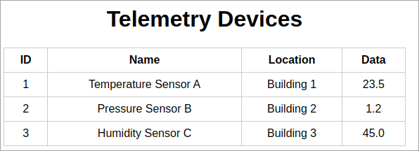
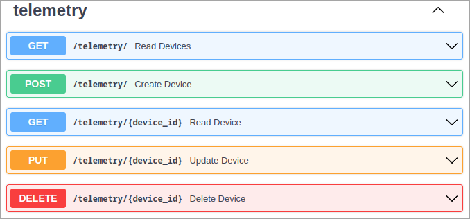

# Telemetry API

A basic CRUD API for telemetry devices using FastAPI, with a visualization screen for the data:


## Features

- Asynchronous database calls using SQLAlchemy and aiosqlite
- Pydantic models for data validation
- Logging and error handling
- Unit testing with pytest and pytest-asyncio
- Continuous Integration/Continuous Deployment (CI/CD) with GitHub Actions to Google Cloud Run
- Dependency management with Poetry

## Requirements

- Python 3.8+
- Poetry

## Getting started

### 1. Clone the repository
```bash
git clone https://github.com/gustavoflw/telemetry-api.git
cd telemetry_api
```

### 2. Set up dependencies
```bash
poetry lock
poetry install
```

### 3. Initialize the database
```bash
python src/init_db.py
```

### 4. Run the application
```bash
uvicorn src.main:app --reload
```
After this, the data can be visualized in http://127.0.0.1:8000/.

### 5. Populate the database
> Option A: run the Python script
```bash
python src/populate_db.py
```

> Option B: use API endpoints
```bash
curl -X POST "http://localhost:8000/telemetry/" \
-H "Content-Type: application/json" \
-d '{"name": "Temperature Sensor A", "location": "Building 1", "data": 23.5}'

curl -X POST "http://localhost:8000/telemetry/" \
-H "Content-Type: application/json" \
-d '{"name": "Pressure Sensor B", "location": "Building 2", "data": 1.2}'

curl -X POST "http://localhost:8000/telemetry/" \
-H "Content-Type: application/json" \
-d '{"name": "Humidity Sensor C", "location": "Building 3", "data": 45.0}'
```

### 6. Access API documentation

FastAPI automatically generates interactive API documentation using OpenAPI standards.
You can access the documentation by running the application and navigating to the following URLs:
- Swagger UI: http://localhost:8000/docs
- ReDoc: http://localhost:8000/redoc


### 7. Testing
This project uses [pytest](https://docs.pytest.org/en/stable/) as the testing framework to ensure the correctness and reliability of the code. Pytest is a simple yet powerful testing tool that makes it easy to write, maintain, and execute test cases.

To run:
```bash
pytest
```

### 8. Deploy
This project was deployed to Google Cloud Run as a service. See the [CI file](.github/workflows/ci.yml).
